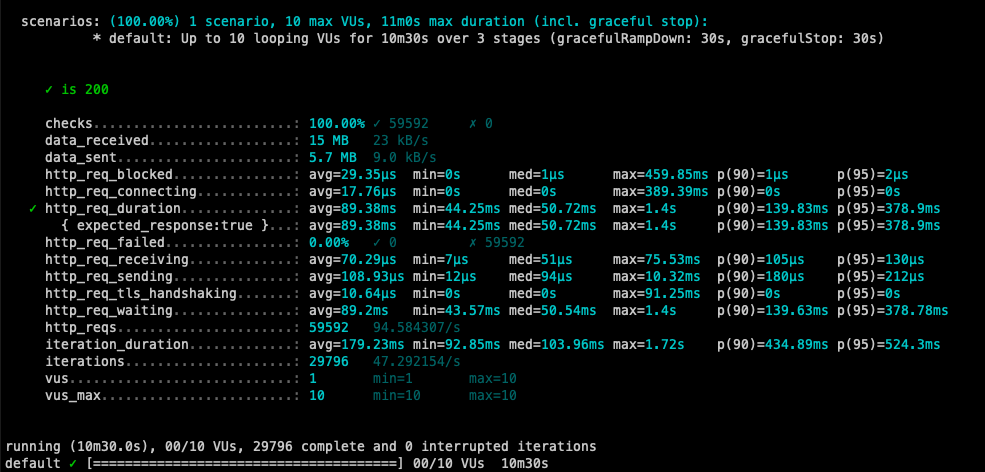
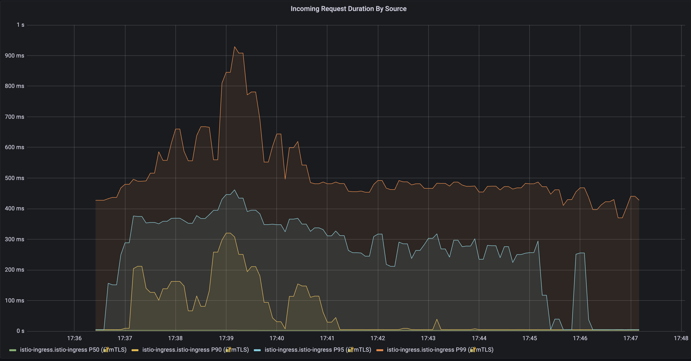
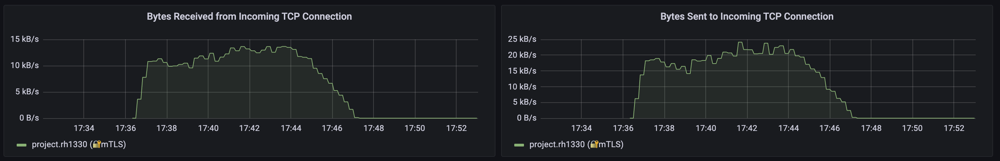

# Final Project Findings - Redwan Hussain

- [Final Project Findings - Redwan Hussain](#final-project-findings---redwan-hussain)
  - [Introduction](#introduction)
  - [Test Procedure](#test-procedure)
  - [Findings](#findings)
    - [Finding 1: Overall System Performance](#finding-1-overall-system-performance)
    - [Finding 2: Latency during increased load](#finding-2-latency-during-increased-load)
    - [Finding 3: Cache behavior](#finding-3-cache-behavior)
  - [Conclusion](#conclusion)

---

## Introduction

This application is designed to classify positive and negative sentiment based on user text input. It consists of two main services: 1) a prediction API that handles user input and Natural Langauge Processing (NLP) model and 2) a Redis cache that stores and retrieves outputs for frequent requests. Caching is employed to optimize system performance by alleviating the load on backend servers and improving overall response times. As part of system evaluation, a load test is conducted to ensure robustness and minimal latency under high user demand.

## Test Procedure

The load test utilizes K6, an open-source testing tool, to simulate traffic from virtual users. It follows a three-stage process: a gradual ramp-up from 0 to 10 users in a 3-second interval, a steady-state that maintains 10 users for 7 minutes, and finally, a ramp-down to 0 users in 3 minutes. A control variable, CACHE_RATE, is introduced to manage input probabilities. A value between 0 and 1, higher CACHE_RATE increases the likelihood of fixed values instead of randomly generated ones for user inputs. For this test, the CACHE_RATE is set to 0.95. 

The success metrics for this test are 1) achieving endpoint performance of at least 10 requests per second and 2) achieving a latency of under 2 seconds for 99% of requests (or p(99)). 

## Findings

### Finding 1: Overall System Performance

Overall, the test was a success. The latency for p(99) was under 2 seconds and the system handled 94.58 requests per second.

### Finding 2: Latency during increased load

There is a noticeable increase in latency at the end of the 3-minute startup. As shown below, the gap between p(50) and p(90), p(95), and p(99) is the largest during this period and then slowly stabilizes. Even while the system was adjusting to the increasing number of virtual users, it was still able to handle responses in an acceptable window of time. This is can be attributed to proper resource allocation. 

### Finding 3: Cache behavior

The load script generates unique events, which might lead to many cache misses. The similarity between the "bytes sent" and "bytes received" graphs suggests that SET and GET operations are occurring at comparable frequencies.

## Conclusion

The sentiment analysis application showcased strong performance and adaptability under varying load conditions. While there were brief latency spikes during user influx, the system adapted rapidly. 